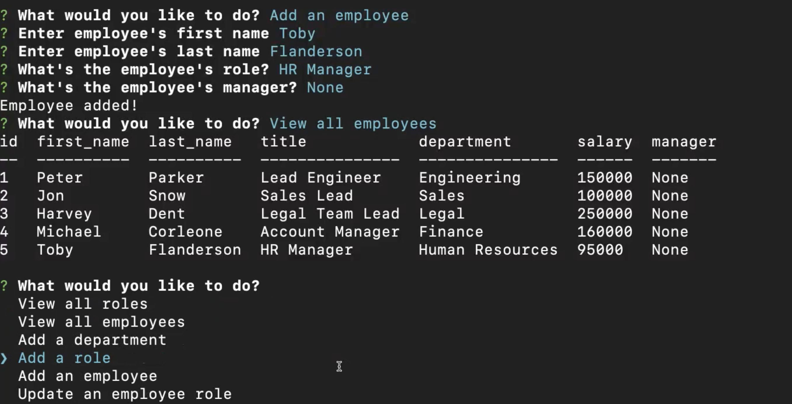

# Employee Tracker

## Description
    
This application allows non-developers to interact with employee information stored in a database.
    
## Table of Contents
    
- [Installation](#installation)
- [Usage](#usage)
- [Contribute](#contribute)
- [Questions](#questions)
    
## Installation

In order to install dependencies, run the following command: 

    npm i
    
## Usage
    
Simply run npm start and answer the questions and everything will be added to the database.

The following video demonstrates the appplication's usage:

## Contribute
    
If you would like to contribute to this project, feel free to make a pull request.

## Questions

If you have any questions, open an issue or contact me directly at abimael.monarrez58@gmail.com. You can find more of my work at [Abimael1996](https://github.com/Abimael1996).

